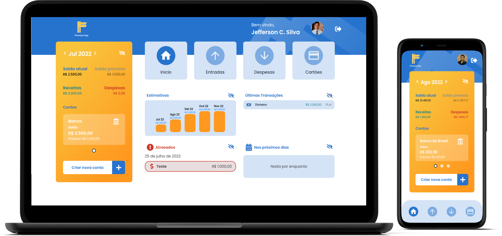

<h3 align="center">
  
</h3>

<h2 align="center">
 Finanças App
</h2>

<h3 align="center">
  Aplicação para gerenciamento de finanças pessoais de forma simples
</h3>

<p align="center">
  
  
  <a href="https://www.linkedin.com/in/jefferson-c-silva-aa1b7b1a9/">
    
  </a>
</p>

<p align="center">
  
</p>

## 💻 Projeto

Finanças App, é um projeto que tem como objetivo gerenciar as finanças pessoais de uma maneira simples e intuitiva. Nele é possível organizar o saldo de todas as contas de uma pessoa, baseado em todas as despesas, receitas e faturas de cartões. Ainda é possível projetar os saldos previstos para os próximos meses e visualizar as últimas transações realizadas.

Essa é a versão web da aplicação, para o seu desenvolvimento foi utilizado ReactJs, Typescript, Styled Components para estilização e Redux para o gerencimanto de estados.

O projeto possui sua API própria, desenvolvida com NestJs, tendo o Prisma como ORM e o PostgreSQL como banco de dados.

## 🚀 Tecnologias

- [TypeScript](https://www.typescriptlang.org/)
- [ReactJS](https://reactjs.org/)
- [Redux](https://redux.js.org/)
- [Styled Components](https://www.styled-components.com/)
- [Firebase](https://firebase.google.com/)

## 🚀 Features

- [x] O usuário poderá se cadastrar ou efetuar o login social com o google.

## ℹ️ How To Use

Primeiro, tenha o ambiente [backend](https://github.com/Jefferson00/FinanceAPI) configurado.

```bash
# Clone this repository
$ git clone https://github.com/Jefferson00/FinancaWeb

# Go into the repository
$ cd financaweb

# Install dependencies
$ yarn install

# Run
$ yarn dev

```

## 📝 License

<a href="/LICENSE">
    
 </a>

Made with ♥ by Jefferson C Silva :wave: [Get in touch!](https://www.linkedin.com/in/jefferson-c-silva)
